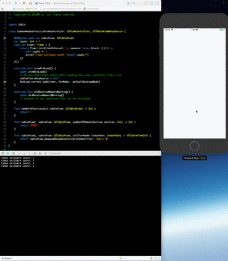
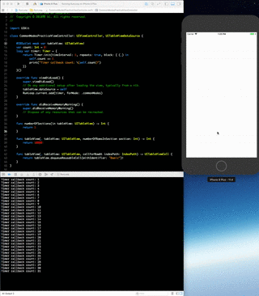

# RunLoop 與 Mode

CFRunLoopMode 和 CFRunLoop 的結構大致長這樣:

```c
struct _CFRunLoopMode {
    CFStringRef _name;            // Mode Name, 例如 @"kCFRunLoopDefaultMode"
    CFMutableSetRef _sources0;    // Set (表示重複是沒有效果的）
    CFMutableSetRef _sources1;    // Set (表示重複是沒有效果的）
    CFMutableArrayRef _observers; // Array
    CFMutableArrayRef _timers;    // Array
    ...
};

struct _CFRunLoop {
    CFMutableSetRef _commonModes;     // Set (Set<ModeName>)
    CFMutableSetRef _commonModeItems; // Set<Source/Observer/Timer>
    CFRunLoopModeRef _currentMode;    // Current Runloop Mode        
    CFMutableSetRef _modes;           // Set
    ...
};

```

RunLoop 結構裡包含了一個叫「CommonModes」的概念。

#### Common Mode:

Mode 可以藉由將其 ModeName \(CFStringRef name;\) 加入到 RunLoop 的 commonModes， 將自己標記為 Common 屬性。每當RunLoop的內容發生變化時，RunLoop 會自動將 \_commonModeItems 裡的 Source/Observer/Timer 同步到有標記過「Common」的Mode裡。常見的應用場景是:

**Scrolling 影響 Timer 回調:**

在 Main Thread 裡，有兩個預設的 Mode，這兩個 Mode 都已被標示了 Common 屬性，分別是:

1. kCFRunLoopDefaultMode:         App 平時所處狀態的 Mode 
2. UITrackingRunLoopMode:        追蹤 ScrollView 滑動狀態的 Mode.

當創建一個 Timer 並加入到 DefaultMode 時， Timer 會正確重複回調，但是當滑動一個 ScrollView 時，RunLoop 會切換到 TrackingRunLoopMode，此時處於 DefaultMode 裡的 Timer 就不會回調，也不會影響滑動操作。

但如果我們需要這個 Timer 在兩個 Modes 裡都執行回調，一般來說有兩種方法：

1. 將 Timer 分別加入這兩個 Mode
2. 將 Timer 加入到頂層 RunLoop 的 commonModeItems 裡。

以下為實際的效果，首先是使用 DefaultMode，在滑動的時候 Mode 變為 UITrackingRunLoopMode，回調就不會發生。

```swift
override func viewDidLoad() {
        super.viewDidLoad()
        // Do any additional setup after loading the view, typically from a nib.
        tableView.dataSource = self
        RunLoop.current.add(timer, forMode: .defaultRunLoopMode)
    }
```



改為 CommonModes 後，Timer的回調在滑動時也可以正常運作。

```swift
override func viewDidLoad() {
        super.viewDidLoad()
        // Do any additional setup after loading the view, typically from a nib.
        tableView.dataSource = self
        RunLoop.current.add(timer, forMode: .commonModes)
    }
```



_更多關於 Timer Source 與 RunLoop 的使用注意事項:_



#### 

### 管理 Mode

CFRunLoop 管理 mode 的 public API 只有2個

```c
CFRunCFRunLoopAddCommonMode(CFRunLoopRef runloop, CFStringRef modeName);
CFRunLoopRunInMode(CFStringRef modeName, ...);
```

在 mode 裡管理 mode item 的接口則有

```c
CFRunLoopAddSource(CFRunLoopRef rl, CFRunLoopSourceRef source, CFStringRef modeName);
CFRunLoopAddObserver(CFRunLoopRef rl, CFRunLoopObserverRef observer, CFStringRef modeName);
CFRunLoopAddTimer(CFRunLoopRef rl, CFRunLoopTimerRef timer, CFStringRef mode);
CFRunLoopRemoveSource(CFRunLoopRef rl, CFRunLoopSourceRef source, CFStringRef modeName);
CFRunLoopRemoveObserver(CFRunLoopRef rl, CFRunLoopObserverRef observer, CFStringRef modeName);
CFRunLoopRemoveTimer(CFRunLoopRef rl, CFRunLoopTimerRef timer, CFStringRef mode);
```

有幾個要點:

1. 要操作內部的 mode 只能通過 mode name
2. 當傳入新的 mode name 但 RunLoop 沒有對應的 mode 時， RunLoop 會自動創建對應的 CFRunLoopModeRef
3. RunLoop 內部的 mode 只能增加不能刪除

### Apple 提供的公開 mode

公開的 mode 有兩個:

1. kCFRunLoopDefaultMode \(NSDefaultRunLoopMode\)
2. UITrackingRunLoopMode

可以用這兩個 mode name 來操作其對應的 mode。

同時 Apple 提供一個操作 Common 標記的字串: kCFRunLoopCommonModes \(NSRunLoopCommonModes\)，使用該字串可

1. 操作 Common Items
2. 標記一個 Mode 為 Common

