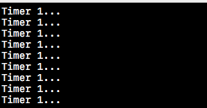
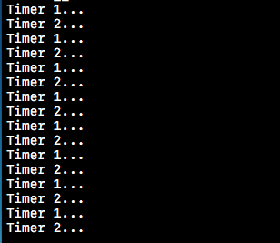

# Timer Source 與 坑

用過 Timer 的人應該知道，Timer 在加入 RunLoop 之前是不會有作用的。要使用 Timer 前，一定要將其加入某個 RunLoop。

常見的 Timer 建構方式就兩種

1. timerWith....
2. scheduledTimerWith......

最大區別是後者在創建時，**會自動以 NSDefaultRunLoopMode 加入到 Current Thread 的 RunLoop 中。**

另外第二個重要的觀念:

### Timer 加入 RunLoop 後，RunLoop 會對 Timer 執行 retain

簡單的示例如下

```swift
weak var timer1: Timer!
weak var timer2: Timer!
override func viewDidLoad() {
    super.viewDidLoad()
    // Do any additional setup after loading the view, typically from a nib.
    timer1 = Timer.scheduledTimer(withTimeInterval: 1, repeats: true, block: { (_) in
        print("Timer 1...")
    })
    timer2 = Timer.init(timeInterval: 1, repeats: true, block: { (_) in
        print("Timer 2...")
    })
}
```

這段代碼會輸出什麼？

答案是

...

...



為什麼 timer1 的回調會執行， timer2 不會呢？便是因為 timer1 是用 scheduledTimer... 創建，使 RunLoop retain 了這個 Timer，因此即便屬性設為 weak，timer1 也沒有被釋放。

相反的 timer 2 在創建時並沒有加入 RunLoop，因此創建完後就直接被釋放了。

所以如果我們在對 Timer 使用弱引用的條件下，應該要先將 Timer 加入 RunLoop 才行，如下：

```swift
weak var timer1: Timer!
weak var timer2: Timer!
override func viewDidLoad() {
    super.viewDidLoad()
    // Do any additional setup after loading the view, typically from a nib.
    timer1 = Timer.scheduledTimer(withTimeInterval: 1, repeats: true, block: { (_) in
        print("Timer 1...")
    })
    
    let _timer2 = Timer.init(timeInterval: 1, repeats: true, block: { (_) in
        print("Timer 2...")
    })
    // 這裡會對 _timer2 retain
    RunLoop.current.add(_timer2, forMode: .defaultRunLoopMode)
    timer2 = _timer2
}
```

這時兩個回調就都會打印了



### 

### Timer 可能會有誤差？

對於 Timer 開發上另一個常碰到的問題就是：「為什麼有時 Timer 的回調沒有執行？」

這個是源於 **Timer 並不是一種實時機制。**

什麼意思？意思是如果在一個循環中，當前的 RunLoop 沒有被識別，或者是正在執行一個長時間的 call out，那 Timer 可能就會存在誤差。RunLoop 在下次循環時會繼續檢查並且決定是否執行 Timer 的回調。也就是說，如果在RunLoop裡有一個繁重的任務，它可能會影響 Timer 回調\( 像是回傳 00:00, 00:01, 00:04，便是略過了兩個循環 2 & 3 \)。 所以 Timer 裡才有一個 tolerance 的屬性，它決定有多少誤差是可以容許的。

這個問題可以從下方代碼演示:

```swift
    weak var timer1: Timer!
    var thread: Thread!
    override func viewDidLoad() {
        super.viewDidLoad()
        // Do any additional setup after loading the view, typically from a nib.
        // 啟用一個自定義的 thread，執行 perfromTask()
        thread = Thread.init(target: self, selector: #selector(performTask), object: nil)
        thread.start()
    }
    
    override func didReceiveMemoryWarning() {
        super.didReceiveMemoryWarning()
        // Dispose of any resources that can be recreated.
    }
    
    @objc func performTask() {
        // 啟用 Timer (加入 RunLoop 中）
        timer1 = Timer.scheduledTimer(withTimeInterval: 1, repeats: true, block: { [weak self] (_) in
            if Thread.current.isCancelled {
                self?.timer1.invalidate()
            }
            print("timer1...")
        })
        
        print("RunLoop before performSelector: \(RunLoop.current)")
        // 2 秒後執行一個繁重的工作，這個方法也是創建一個 timer source 等待回調。
        perform(#selector(doSomeHeavyLoadingCalculation), with: nil, afterDelay: 2.0)
        
        print("RunLoop after performSelector: \(RunLoop.current)")
        
        RunLoop.current.run()
        
        //注意！ 這裡在 thread cancel 之前將永遠不會執行，
        print("After Run Loop Run!")
    }
    
    @objc func doSomeHeavyLoadingCalculation() {
        for i in 0...10000 {
            print("\(Thread.current) \(i)")
            if Thread.current.isCancelled {
                return
            }
        }
    }
```

Timer 回調在 2 秒後會一直等到 `doSomeHeavyLoadingCalculation()` 完成後才會繼續打印。像是

```text
timer1...
timer1...
Thread(3) 0
Thread(3) 1
Thread(3) 2
...
Thread(3) 10000
timer1...
```

這就是在同一個 RunLoop 裡，一個長 call out 影響了原本 timer 回調的狀況。這也證明 Timer 不是實時系統機制。

但還有幾個值得一提的點，除了1.在其他章節也都有提到:

1. Timer 會對 Target 進行強引用。 也就是說如果沒有將 thread cancel 掉，即便關閉 controller 也無法正確釋放。
2. 不是 main thread 的 RunLoop 是不會自動運行的。因為預設非主線程的 RunLoop 在第一次調用前不會自動創建。所以需要手動 `RunLoop.current.run()`
3. RunLoop 運行前必須先加入 Timer \|\| Source \|\| Observer 否則會直接退出。
4. `RunLoop.current.run()` 之後的程式碼在 `thread.cancel()` 調用前都不會執行。這也說明了 RunLoop 本身是一個循環。直到 RunLoop 退出之前，之後的代碼不會立即執行。
5. Perform Selector 系列的 API 很有趣，不同的調用會影響這個案例需不需要 run 起 RunLoop，整理在下一小節。

### Perform\(selector:, ...\) 的機制

**performSelector:withObject:afterDelay:**

這個 API 帶有 延緩執行的 delay 參數，不難想像本質還是通過創建 Timer 並且加入到當前線程的 RunLoop。所以 RunLoop 不啟用，就不會執行。

#### performSelector:withObject:

這個方法機制就不同了，會直接調用 `selector`，和執行 `RunLoop.current.run()` 無關了

#### performSelector:onThread:withObject:waitUntilDone:

這個是否需要啟用 RunLoop 的關鍵在於 waitUntilDone: 的參數裡。當傳入的 thread 和 current thread 相同時，如果傳入 `true` ，系統會直接調用 `selector`，並且等待至完成才會繼續執行。但如果傳入 `false`，會將這個任務 enqueue 進 RunLoop 裡等待調用。所以要執行 `RunLoop.current.run()` 才會回調。


