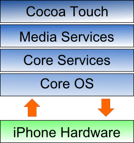
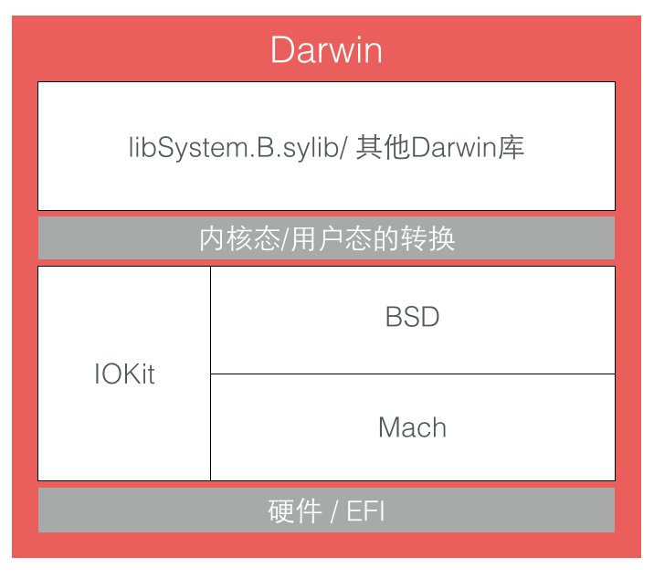

# RunLoop 與 底層實現

由[源碼](https://opensource.apple.com/source/CF/CF-855.17/CFRunLoop.c)我們可以知道，RunLoop 的核心是基於 mach port 實現的，進入休眠時會調用 mach\_msg\(\)，進入核心態。（底層我看得雲裡霧裡的，現階段就別不懂裝懂了 T\_T，提供個[參考連結](https://www.jianshu.com/p/85e931636f27)）

要理解底層實現的邏輯，就要先知道 iOS 的系統架構，如圖\([來源](https://blog.ibireme.com/2015/05/18/runloop/)\)



系統大致上劃分四個層次

1. [Cocoa Touch Layer](https://www.techotopia.com/index.php/The_iPhone_OS_Cocoa_Touch_Layer)：我們都很熟悉的那層，提供基礎的高級框架像是 UIKit, MapKit, Push Notification, MessageUI, AddressUI, GameKit。
2. [Media Services Layer](https://www.techotopia.com/index.php/The_iPhone_OS_Media_Layer)：提供影音、動畫以及圖像繪製的階層，像是 CoreGraphics, QuartzCore, OpenGL...。
3. [Core Services Layer](https://www.techotopia.com/index.php/The_iPhone_OS_Core_Services_Layer)：提供一些更基礎的，給予其他框架應用的基本框架，例如 AddressBook, CoreData, Core Foundation, Foundation, SQLite...。
4. [Core OS Layer](https://www.techotopia.com/index.php/The_iPhone_OS_Core_OS_Layer)：介接在硬體層上的最基本的一層，提供的內容包含 CFNetwork, ExternalAccessory, Security,  LibSystem, Darwin...。

這裡我們要特別提 Darwin。

### Darwin

Darwin 是操作系統的核心，包括內核、驅動、Shell 等內容，它是開源的，可以[來這找](https://github.com/apple/darwin-xnu)。

先來看 Darwin 的架構 \([圖源](https://blog.ibireme.com/2015/05/18/runloop/)\)



硬體上面分成三個組成部分：Mach、BSD、IOKit ，共同組成了 XNU 內核。

XNU 內核的內環被稱作 Mach，僅提供了諸如處理器調度、IPC \(進程間通信\)等非常少量的基礎服務。  


BSD 層可以看作圍繞 Mach 層的一個外環，其提供了諸如進程管理、文件系統和網絡等功能。  


IOKit 層是為設備驅動提供了一個面向對象\(C++\)的一個框架。  


### Mach

Mach 提供的 API 十分有限但都十分基礎，Apple 也不鼓勵使用。在 Mach 中，所有東西都是通過物件實現的，進程、線程與虛擬內存都被稱作為「物件」。但和其他架構不同，Mach 的物件之間不能直接調用，只能透過消息傳遞的方式實現物件之間的通信。**「消息」是 Mach 最基礎的概念**，消息在兩個 port 間傳遞，實現進程間通信 \(IPC\)。

Mach 消息定義在 &lt;mach/message.h&gt; 裡，內容很單純

```c
typedef struct {
  mach_msg_header_t header;
  mach_msg_body_t body;
} mach_msg_base_t;

typedef struct {
  mach_msg_bits_t msgh_bits;
  mach_msg_size_t msgh_size;
  mach_port_t msgh_remote_port;
  mach_port_t msgh_local_port;
  mach_port_name_t msgh_voucher_port;
  mach_msg_id_t msgh_id;
} mach_msg_header_t;
```

一條 Mach 消息就是個 BLOB，頭部定義當前端口 local\_port 和目標端口 remote\_port，發送和接收消息通過同一個API

```c
mach_msg_return_t mach_msg(
 mach_msg_header_t *msg,
 mach_msg_option_t option, // Option 定義消息傳遞方向
 mach_msg_size_t send_size,
 mach_msg_size_t rcv_size,
 mach_port_name_t rcv_name,
 mach_msg_timeout_t timeout,
 mach_port_name_t notify
 );
```

為了實現消息的收送， mach\_msg\(\) 實際上是調用了一個 mach\_msg\_trap\(\) \(Mach 陷阱\)。 Trap 在 Mach 等同系統調用，當在用戶態調用 mach\_msg\_trap\(\) 時會觸發陷阱機制切換至內核態。內核態中內核實現的 mach\_msg\(\) 會完成實際的工作，如圖：


相關概念: [System\_call](https://en.wikipedia.org/wiki/System_call)、[Trap\_\(computing\)](https://en.wikipedia.org/wiki/Trap_%28computing%29)

RunLoop 的核心就是一個 mach\_msg\(\)，RunLoop 調用該函數去接收消息，如果沒有對象發送 port 消息，內核會將線程置於等待狀態。舉例來說：平常在 Simulator 跑 App，然後在靜止時按下暫停，main thread 的 stack 會停在 mach\_msg\_trap\(\) 這個地方，便是這個概念。

舉體來說 mach port 的發送信息機制可以參考[這篇](http://nshipster.com/inter-process-communication/)。

