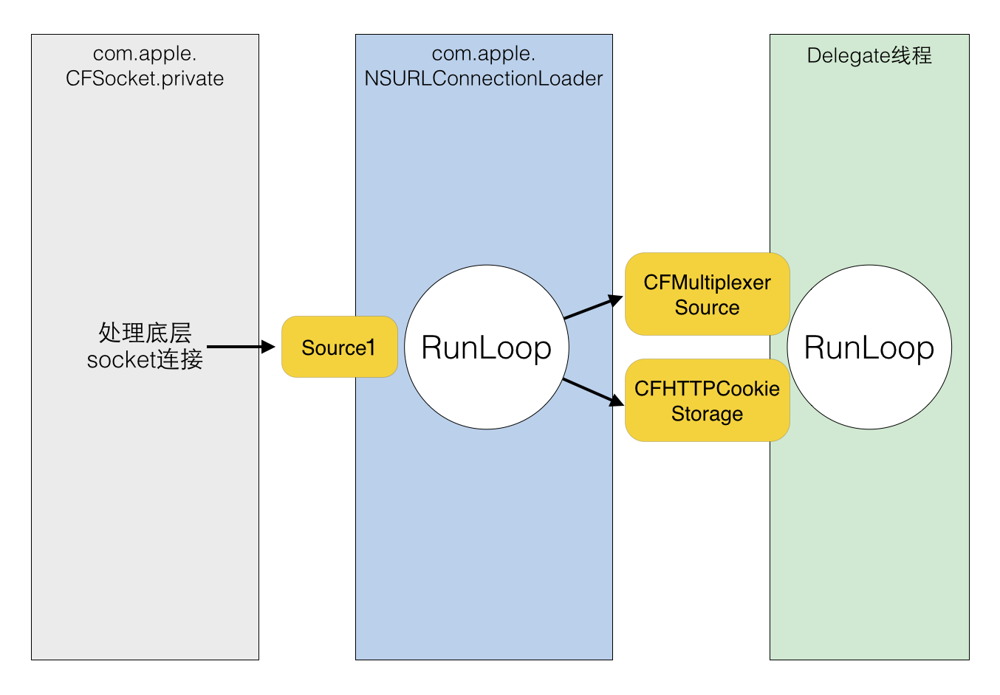

# RunLoop 與 應用

談到應用前先來理解一下 App launch 之後 RunLoop 的狀態 \(內容就直接挪過來了, 補充了 Name 上去）

```c
CFRunLoop {
    current mode = kCFRunLoopDefaultMode
    common modes = {
        UITrackingRunLoopMode
        kCFRunLoopDefaultMode
    }
    common mode items = {
        // source0 (manual)
        CFRunLoopSource {order =-1, {
            callout = _UIApplicationHandleEventQueue}}
        CFRunLoopSource {order =-1, {
            callout = PurpleEventSignalCallback }}
        CFRunLoopSource {order = 0, {
            callout = FBSSerialQueueRunLoopSourceHandler}}
        // source1 (mach port)
        CFRunLoopSource {order = 0,  {port = 17923}}
        CFRunLoopSource {order = 0,  {port = 12039}}
        CFRunLoopSource {order = 0,  {port = 16647}}
        CFRunLoopSource {order =-1, {
            callout = PurpleEventCallback}}
        CFRunLoopSource {order = 0, {port = 2407,
            callout = _ZL20notify_port_callbackP12__CFMachPortPvlS1_}}
        CFRunLoopSource {order = 0, {port = 1c03,
            callout = __IOHIDEventSystemClientAvailabilityCallback}}
        CFRunLoopSource {order = 0, {port = 1b03,
            callout = __IOHIDEventSystemClientQueueCallback}}
        CFRunLoopSource {order = 1, {port = 1903,
            callout = __IOMIGMachPortPortCallback}}
        // Ovserver
        CFRunLoopObserver {order = -2147483647, activities = 0x1, // Entry
            callout = _wrapRunLoopWithAutoreleasePoolHandler}
        CFRunLoopObserver {order = 0, activities = 0x20,          // BeforeWaiting
            callout = _UIGestureRecognizerUpdateObserver}
        CFRunLoopObserver {order = 1999000, activities = 0xa0,    // BeforeWaiting | Exit
            callout = _afterCACommitHandler}
        CFRunLoopObserver {order = 2000000, activities = 0xa0,    // BeforeWaiting | Exit
            callout = _ZN2CA11Transaction17observer_callbackEP19__CFRunLoopObservermPv}
        CFRunLoopObserver {order = 2147483647, activities = 0xa0, // BeforeWaiting | Exit
            callout = _wrapRunLoopWithAutoreleasePoolHandler}
        // Timer
        CFRunLoopTimer {firing = No, interval = 3.1536e+09, tolerance = 0,
            next fire date = 453098071 (-4421.76019 @ 96223387169499),
            callout = _ZN2CAL14timer_callbackEP16__CFRunLoopTimerPv (QuartzCore.framework)}
    },
    modes ＝ {
        CFRunLoopMode  {
            name = kCFRunLoopDefaultMode,
            sources0 =  { /* same as 'common mode items' */ },
            sources1 =  { /* same as 'common mode items' */ },
            observers = { /* same as 'common mode items' */ },
            timers =    { /* same as 'common mode items' */ },
        },
        CFRunLoopMode  {
            name = UITrackingRunLoopMode,
            sources0 =  { /* same as 'common mode items' */ },
            sources1 =  { /* same as 'common mode items' */ },
            observers = { /* same as 'common mode items' */ },
            timers =    { /* same as 'common mode items' */ },
        },
        CFRunLoopMode  {
            name= UIInitializationRunLoopMode,
            sources0 = {
                CFRunLoopSource {order = 0, {
                    callout = FBSSerialQueueRunLoopSourceHandler}}
            },
            sources1 = (null),
            observers = {
                CFRunLoopObserver >{activities = 0xa0, order = 2000000,
                    callout = _ZN2CA11Transaction17observer_callbackEP19__CFRunLoopObservermPv}
            )},
            timers = (null),
        },
        CFRunLoopMode  {
            name = GSEventReceiveRunLoopMode,
            sources0 = {
                CFRunLoopSource {order = -1, {
                    callout = PurpleEventSignalCallback}}
            },
            sources1 = {
                CFRunLoopSource {order = -1, {
                    callout = PurpleEventCallback}}
            },
            observers = (null),
            timers = (null),
        },
        CFRunLoopMode  {
            name = kCFRunLoopCommonModes,
            sources0 = (null),
            sources1 = (null),
            observers = (null),
            timers = (null),
        }
    }
}
```

由上可知，系統默認會註冊五個 Mode:

1. kCFRunLoopDefaultMode: App Default Mode, main thread 通常在這個 mode 下運行。
2. UITrackingRunLoopMode: 跟蹤介面的 Mode，用於 ScrollView 追蹤觸摸滑動，以保證滑動時候不受其他 mode 干擾。
3. UIInitializationRunLoopMode: 啟動 App 時第一個進入的 Mode，啟動完成就不再使用。 \(不過我在 appDidLaunch.. 裡打印並沒有看見這個 mode）
4. GSEventReceiveRunLoopMode: 接受系統內部事件的 mode，一般用不到。
5. kCFRunLoopCommonModes: 佔位用的 mode, 沒有實際作用。

若有興趣，[這裏](http://iphonedevwiki.net/index.php/CFRunLoop)有更多 Apple 內部的 mode，雖然開發上大抵用不著。

接下來整理幾個和 RunLoop 相關的機制

### Timer

timer 的部分已有章節特別整理了。



在這裡再額外提一個 CADisplayLink

#### CADisplayLink

CADisplayLink 是一個 Timer，更新頻率和屏幕刷新頻率相同，**它也需要加入到 RunLoop 才能執行**。和 Timer 相同，CADisplayLink 也是基於 CFRunLoopTimerRef 實現，底層使用 mk\_timer。 和 Timer 相比他的精確度更高，但**如果碰到繁重的 task 產生的長 call out，也會存在掉幀的問題**。通常 CADisplayLink 用來構建以幀為精確度的動畫，看起來會比使用 Timer 相對流暢，Timer 則有更廣泛的用途。

### AutoreleasePool 


這 part 需要對自動釋放池有基本的理解，日後會再整理 AutoreleasePool 的內容，預計是會放在 ARC 機制的文章裡。


雖然自動釋放池和 RunLoop 沒有直接關係，但常拿來一起討論，也是面試時容易遇到的問題（重點）。

iOS App 在 launch 後會註冊兩個 Observer 以管理和維護 AutoreleasePool。先來看下打印的結果 \(省去一些無關的資訊\)：

```c
observers = (
    "<CFRunLoopObserver 0x600000123700 [0x10576cc80]>{ 
        ..., 
        order = -2147483647, 
        callout = _wrapRunLoopWithAutoreleasePoolHandler (0x10591ad92), 
        ... 
        }"
    .... ///其他 Observers
    "<CFRunLoopObserver 0x6000001238e0 [0x10576cc80]>{ 
        ..., 
        order = 2147483647, 
        callout = _wrapRunLoopWithAutoreleasePoolHandler (0x10591ad92), 
        ... 
    }"
)
```

可以看見兩個相關的 observers 的 callout 都是  \_wrapRunLoopWithAutoreleasePoolHandler。

區別是

#### \_wrapRunLoopWithAutoreleasePoolHandler \(1\):

會監聽 RunLoop 的進入，回調 `objc_autoreleasePoolPush()` 向當前 AutoreleasePoolPage 增加一個哨兵物件標誌創建自動釋放池。order 是 -2147483647，表示優先級最高，會發生在所有回調之前。

#### \_wrapRunLoopWithAutoreleasePoolHandler \(2\)

會監聽 RunLoop 即將休眠或退出的兩種狀態，即將休眠時會調用 `objc_autoreleasePoolPop()` 與 `objc_autoreleasePoolPush()` ，根據情況從最新加入的物件一直往前清理，直到遇到哨兵物件。

而在即將退出 RunLoop 時會調用`objc_autoreleasePoolPop()`釋放自動釋放池內的對象。 order 是 2147483647，表示優先級最低，會發生在所有回調之後。

### UI 更新

剛剛打印的主線程 RunLoop 裡還有一個 observer 為

```text
<CFRunLoopObserver 0x600000123e80 [0x10576cc80]>{
    ...,
    order = 2000000, 
    callout = _ZN2CA11Transaction17observer_callbackEP19__CFRunLoopObservermPv (0x10be5a4ce),
    ...
}
```

這個 observer 負責監聽 UI 變化後的更新，比如

1. 修改 frame
2. 調整 UI 層級 \(UIView/CALayer\)
3. 手動設置 setNeedsDisplay\(\) / setNeedsLayout\(\)

這些操作上對應的 UIView/CALayer 會被標記為待處理，提交到一個全局容器裡。

這個 Observer 監聽主線程 RunLoop 的即將進入休眠和退出的狀態，一旦進入這兩種狀態，就會遍歷所有 UI 更新並進行實際繪製更新，也就是callout長函數的內容 :

```text
_ZN2CA11Transaction17observer_callbackEP19__CFRunLoopObservermPv()
```

這函數內部的邏輯大概是

```c
_ZN2CA11Transaction17observer_callbackEP19__CFRunLoopObservermPv()
    QuartzCore:CA::Transaction::observer_callback:
        CA::Transaction::commit();
            CA::Context::commit_transaction();
                CA::Layer::layout_and_display_if_needed();
                    CA::Layer::layout_if_needed();
                        [CALayer layoutSublayers];
                            [UIView layoutSubviews];
                    CA::Layer::display_if_needed();
                        [CALayer display];
                            [UIView drawRect];
```



這裡很多文章都會一並提到 Facebook 開源的 [Texture](https://github.com/TextureGroup/Texture) \(前身是 AsyncDisplayLink\)，這是一個優化 iOS app interface 的框架，其內部也是使用到 RunLoop，來解決可能的介面卡頓問題。 之後會來實際玩玩看，並且寫篇心得整理。


### 網路請求

iOS 中的網路請求層由下至上包含

```text
CFSocket
CFNetwork                  -> ASIHttpRequest
NSURLConnection            -> AFNetworking
NSURLSession (after iOS 7) -> AFNetworking2, Alamofire
```

* CFSocket: 最底層接口，只負責 socket 通信。
* CFNetwork: 基於 CFSocket 接口的封裝，ASIHttpRequest 在這層工作
* NSURLConnection: 基於 CFNetwork 的封裝，提供 OO 的接口，AFNetworking 在這層工作
* NSURLSession: iOS 7 後才新增的接口，雖然和 NSURLConnection 並列，但也會用到 NSURLConnection 的部分功能 \(像是 com.apple.NSURLConnectionLoader\)。AFNetworking2 和 Alamofire 這在層工作。

和 RunLoop 之間的關聯可以先看這張圖



當使用 NSURLConnection 時，會傳入一個 Delegate，當調用 start\(\) 方法後，Delegate 會不斷收到事件回調。 原理上，其實在 start 函數裡，會獲取 CurrentRunLoop，然後在 DefaultMode 裡新增 4 個 Source0 \(需要主動觸發\)。其他 CFMultiplexerSource 負責各種 Delegate 回調，CFHTTPCookieStorage 處理各種 Cookie。

開始網路傳輸時，NSURLConnection 會創建兩個新線程:

1. com.apple.CFSocket.private: 處理底層 socket 連接。 
2. com.apple.NSURLConnectionLoader:  使用 RunLoop 來接收底層 socket 事件，並且通過之前添加的 Source0 通知上層 Delegate。 RunLoop 通過一些 Source1 \(mach\_port\) 來接收底層 CFSocket 的通知。收到通知後會在合適時機向 CFMultiplexer 等 Source0 發送通知，同時喚醒 Delegate 線程的 RunLoop 來讓其處理這些通知。CFMultiplexerSource 會在 Delegate 線程的 RunLoop 對 Delegate 執行實際的回調。

接下來看個網路請求實際的應用:

#### AFNetworking

AFURLConnectionOperation 基於 NSURLConnection 構建，希望能在後台線程接收 Delegate 回調。為此，AFNetworking 單獨創建了一個線程，並在該線程啟動了一個 RunLoop：

```objectivec
+ (void)networkRequestThreadEntryPoint:(id)__unused object {
    @autoreleasepool {
        [[NSThread currentThread] setName:@"AFNetworking"];
        NSRunLoop *runLoop = [NSRunLoop currentRunLoop];
        // 由於 RunLoop 的啟動至少要包含一個 Timer/Observer/Source 才能啟動。
        // 所以此處新增一個 NSMachPort。 通常情況需要持有這個 port 才能在外部線程通過這個 port
        // 發送消息到 loop 內，但這裡只是為了不讓 RunLoop 退出，沒有實際發送消息的功用。
        [runLoop addPort:[NSMachPort port] forMode:NSDefaultRunLoopMode];
        [runLoop run];
    }
}

+ (NSThread *)networkRequestThread {
    static NSThread *_networkRequestThread = nil;
    static dispatch_once_t oncePredicate;
    dispatch_once(&oncePredicate, ^{
        _networkRequestThread = [[NSThread alloc] initWithTarget:self selector:@selector(networkRequestThreadEntryPoint:) object:nil];
        [_networkRequestThread start];
    });
    return _networkRequestThread;
}
```

當需要在該後台線程執行任務，會調用 \[NSObject performSelector:onThread:...\] 仍到後台的 RunLoop 中

```objectivec
- (void)start {
    [self.lock lock];
    if ([self isCancelled]) {
        [self performSelector:@selector(cancelConnection) onThread:[[self class] networkRequestThread] withObject:nil waitUntilDone:NO modes:[self.runLoopModes allObjects]];
    } else if ([self isReady]) {
        self.state = AFOperationExecutingState;
        [self performSelector:@selector(operationDidStart) onThread:[[self class] networkRequestThread] withObject:nil waitUntilDone:NO modes:[self.runLoopModes allObjects]];
    }
    [self.lock unlock];
}
```


